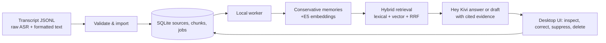

# Kivi Memory Workbench

Kivi Memory Workbench is an evidence-backed semantic-memory companion for transcript history. It preserves raw ASR and formatted text, indexes the history, derives cautious fact/preference candidates, and answers only with inspectable source evidence. The system can be run locally or deployed as a full-stack cloud application.

The product direction is summarized in [positioning_statement.md](positioning_statement.md) and [vision.md](vision.md).

The main interface is a desktop-first responsive UI, accessible locally via FastAPI/Vite (`http://127.0.0.1:8000`) or through the live cloud deployment on Vercel connected to Render. Its visual system uses a warm off-white workspace, forest-green type, pale-green evidence surfaces, and a direct path from a Hey Kivi answer to its source history.

## Product flow

1. Create a memory workspace and paste compatible UTF-8 JSONL.
2. Validate, import, and process records into durable SQLite jobs.
3. Ask Hey Kivi a question or request a draft.
4. Open every returned source in History to inspect its raw dictation, formatted transcript, indexed passages, and derived memory candidates.
5. Correct, suppress, or delete memory state. Revision checks and operation IDs make lifecycle operations safe to retry.

## Focused use cases

- **Recover context:** find a prior dictated update and open the original transcript rather than relying on a bare summary.
- **Understand changes:** retrieve the latest supported project detail while keeping earlier records visible for review.
- **Prepare a next response:** request a grounded draft whose supporting sources remain one click away.

## Architecture

- **UI:** React, TypeScript, Vite; desktop-first responsive layout (locally served or hosted on Vercel).
- **API/worker:** FastAPI, Pydantic, and a durable worker queue; supports both local operation and cloud hosting on Render.
- **Persistence:** SQLite/WAL, SQLAlchemy, Alembic migrations.
- **Memory:** source records, chunks, embeddings, derived memories, and content-minimized lifecycle operations.
- **Retrieval:** lexical ranking plus normalized `intfloat/multilingual-e5-small` cosine ranking where local vectors are present; reciprocal-rank fusion selects cited source evidence. A deterministic character n-gram fallback is clearly used when E5 is unavailable.
- **Generation:** the server-only Sarvam adapter receives selected evidence. Without `SARVAM_API_KEY`, the product returns transparent source replay rather than inventing an LLM result.

## Included evidence

`data/synthetic-500.jsonl` is a deterministic, fictional 500-record corpus covering schedules, preferences, episodes, corrections, hypotheses, drafts, ASR differences, and code-switched Hindi examples. `eval/cases.jsonl` has 120 frozen evidence-labelled retrieval cases. The committed [evidence report](eval/results/evidence-report.json) records a completed local rehearsal: 120/120 expected source/text evidence checks passed.

With the server-side Sarvam key configured, [the live smoke report](eval/results/live-smoke-report.json) exercised one case from each of the 12 corpus families: 12/12 cases passed, with 7,624 total provider tokens and 1.12 s p50 / 3.22 s p95 end-to-end latency. At Sarvam's documented 2026-09-09 rates, those uncached input/output tokens cost an estimated ₹0.306152. It uses only fictional records and is a focused integration smoke test, not a broad model-quality claim.

The [multilingual embedding report](eval/results/multilingual-embedding-report.json) separately verifies the real persisted E5 path: an English dentist query ranks the fully Hindi dentist record first with no lexical rank, demonstrating that the result came through dense multilingual retrieval rather than token overlap.

That report verifies grounded source retrieval and provenance, not broad model quality. The evaluation does not claim comprehensive temporal reasoning, multi-hop reasoning, live Sarvam quality, or language-specific semantic-recall benchmarks.

## Run and inspect

See [RUN.md](RUN.md) for the exact fresh local setup, migration, seed, processing, evaluation, inspection, and reset commands. Input fields and limits are documented in [docs/import-format.md](docs/import-format.md).

Copy `backend/.env.example` to `backend/.env` only when you need local overrides. The real `.env`, databases, model cache, build output, and private working notes are ignored. GitHub Actions runs the offline backend tests and lint plus frontend type-check/build on every push and pull request.

## Live deployment (Vercel + Render)

- **Live frontend (Vercel)**: **[hey-kivi-sarvam-dnaq.vercel.app](https://hey-kivi-sarvam-dnaq.vercel.app/)**
- **Live backend (Render)**: **[hey-kivi-sarvam.onrender.com](https://hey-kivi-sarvam.onrender.com/)**

The live frontend on Vercel is connected directly to the FastAPI backend on Render via `VITE_API_BASE_URL=https://hey-kivi-sarvam.onrender.com`. The backend natively allows cross-origin requests from the Vercel app via configured `TRUSTED_ORIGINS`.

For deployment details:
- [Vercel deployment guide](docs/deploy-vercel.md)
- [Render deployment guide](docs/deploy-render.md)

## Scope and limitations

- **Deployment Architecture**: The application supports both local execution and a full shared cloud deployment. In production, the React frontend is deployed on Vercel ([hey-kivi-sarvam-dnaq.vercel.app](https://hey-kivi-sarvam-dnaq.vercel.app/)) and connected to the live HTTPS FastAPI backend on Render ([hey-kivi-sarvam.onrender.com](https://hey-kivi-sarvam.onrender.com/)) with CORS configured. For offline review or isolated development, the backend runs locally with loopback or dynamic host/port bindings (`kivi-memory serve`). The browser-local `localStorage` demo mode exists solely as an unconfigured fallback in the frontend when `VITE_API_BASE_URL` is omitted.
- **Input Boundaries**: The project operates on standard transcript pairs (`raw_asr` and `formatted_text`) formatted as UTF-8 JSONL. It does not interface with the installed Kivi desktop application via native OS hooks, nor does it perform live microphone audio capture/ASR.
- **Provider Security & Isolation**: All provider interactions (Sarvam API) are strictly server-side. The API key (`SARVAM_API_KEY`) is optional, is never exposed to the browser, and is not stored in this repository. When the key is omitted, the backend transparently returns grounded source replay and controlled memory answers without crashing.
- **Evaluation Scope**: 
  - The offline 120-case retrieval benchmark (`eval/results/evidence-report.json`) verifies evidence retrieval and source provenance (120/120 passed).
  - The live smoke suite (`eval/results/live-smoke-report.json`) exercises real provider integration across 12 distinct corpus categories using `sarvam-105b` (12/12 passed, 7,624 tokens, 1.12 s p50 latency).
  - The cross-lingual evaluation (`eval/results/multilingual-embedding-report.json`) demonstrates dense vector retrieval from English queries to Hindi transcripts using `intfloat/multilingual-e5-small` without token overlap.
  - These suites validate grounded provenance, multilingual vector matching, and provider integration; they are not intended as broad academic quality benchmarks for general NLP reasoning.
- **Multi-Tenant Access**: Namespaces provide isolated memory workspaces within a deployment, but the current prototype lacks a multi-tenant user authentication layer. Public instances should be used with synthetic or sanitized records.

