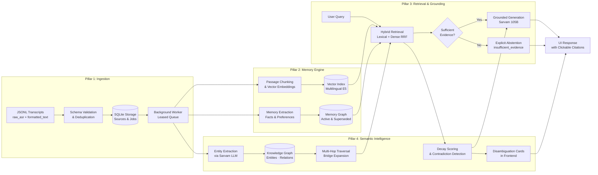

# Hey Kivi: Semantic Memory for Spoken Interactions

I built Kivi because I noticed something frustrating: voice notes are incredibly easy to create and almost impossible to search later. A useful detail gets buried in yesterday's standup, mixed with an older plan, or phrased differently from how you'd search for it. Kivi fixes that.

It's an evidence-backed semantic memory engine that indexes spoken transcripts, extracts durable facts and preferences, builds a relational knowledge graph across entities, and generates answers strictly grounded in verifiable source evidence, with full provenance and clickable citations.

[](https://fastapi.tiangolo.com/)
[](https://react.dev/)
[](https://www.typescriptlang.org/)
[](https://www.python.org/)
[](https://www.sqlite.org/)
[](https://github.com/na24b030-eng/hey-kivi-sarvam/actions)

> **Why this exists:** Read the [Product Vision](vision.md) and [Product Positioning](positioning.md).

---

## What makes this interesting

- **Dual-View Speech Ingestion**: Preserves raw ASR output alongside formatted text. This lets me do phonetic matching on the messy transcription without propagating disfluencies into answers.
- **Hybrid Multilingual Retrieval**: Combines token-level lexical search with dense multilingual vectors (`intfloat/multilingual-e5-small`) using Reciprocal Rank Fusion. Query in English, find results dictated in Hindi.
- **Relational Knowledge Graph**: Entities, aliases, and relationships are extracted from transcripts and stored in a SQLite-backed graph. Multi-hop traversal connects facts across separate conversations (e.g., "Who manages the person working on Project Lantern?").
- **Memory Decay & Contradiction Detection**: Scheduled items (meetings, deadlines) naturally decay over time. When conflicting information appears within a configurable time window, Kivi surfaces disambiguation cards instead of silently picking one.
- **Strict Grounding & Abstention**: When context is missing or ambiguous, the engine explicitly says "I don't have enough evidence" rather than hallucinating. Every claim in an answer links back to a source transcript.
- **Full User Governance**: Inspect, correct, suppress, or delete any extracted memory. Changes take effect immediately and survive restarts.

---

## Architecture

The system has four pillars that I built incrementally:



### The four pillars, explained

| Pillar | What it does | Key decision |
|:---|:---|:---|
| **1. Ingestion** | Schema validation, dedup, dual-view indexing of raw ASR + formatted text | Kept both text views because raw ASR enables phonetic fuzzy matching while formatted text gives clean answers |
| **2. Memory Engine** | Passage chunking, multilingual embedding, regex-based memory candidate extraction | Used `intfloat/multilingual-e5-small` (118M params) so it runs on CPU without GPU dependency |
| **3. Retrieval & Grounding** | Hybrid lexical+dense RRF search, evidence sufficiency check, Sarvam 105B synthesis | RRF fusion avoids the failure modes of pure lexical or pure semantic search alone |
| **4. Semantic Intelligence** | LLM entity extraction, coreference resolution, knowledge graph, multi-hop bridging, time-decay, contradiction detection | Built the graph in SQLite (4 tables) instead of Neo4j to keep the stack simple and deployable on free tiers |

---

## Live Deployments

Everything runs on free tiers:

| Platform | URL | What it runs |
|:---|:---|:---|
| **Vercel** | [hey-kivi-sarvam-dnaq.vercel.app](https://hey-kivi-sarvam-dnaq.vercel.app) | React frontend (Vite build) |
| **Render** | [hey-kivi-sarvam.onrender.com](https://hey-kivi-sarvam.onrender.com) | FastAPI backend + SQLite |
| **GitHub** | [na24b030-eng/hey-kivi-sarvam](https://github.com/na24b030-eng/hey-kivi-sarvam) | Source + CI (pytest, ruff, vitest) |

Health: [`/api/health`](https://hey-kivi-sarvam.onrender.com/api/health) · Readiness: [`/api/readiness`](https://hey-kivi-sarvam.onrender.com/api/readiness)

> **Note:** Render's free tier cold-starts after 15 min of inactivity. First request may take ~30s.

---

## What you can do with it

### 1. Context Recovery
Ask "When does Harbor launch?" and get the exact date with a clickable citation back to the original transcript. Works across languages: query in English, find results dictated in Hindi.

### 2. Multi-Hop Reasoning
Ask "Who manages the person working on Project Lantern?" and Kivi bridges across separate conversations: one where someone was assigned to Lantern, another where their manager was mentioned.

### 3. Contradiction Handling
When you say "meeting moved to Thursday" but an earlier note says "meeting is Wednesday," Kivi surfaces an amber disambiguation card asking you to clarify instead of silently picking one.

### 4. Memory Decay
Scheduled items like "dentist appointment next Tuesday" naturally lose relevance over time. Kivi applies soft exponential decay so stale scheduled items rank lower than fresh permanent facts.

### 5. Direct Governance
Inspect, correct, or suppress any extracted memory through the UI. Suppressed memories are immediately excluded from future answers. Source deletions cascade cleanly.

---

## Evaluation & Benchmarks

I built a frozen evaluation suite to make sure things actually work:

| Suite | Cases | Metric | Result |
|:---|:---:|:---|:---:|
| Retrieval & Abstention | 120 | Grounded Accuracy | **120/120 (100%)** |
| Live Provider Smoke | 13 | End-to-End with Sarvam 105B | **13/13 (100%)** |
| Cross-Lingual Embedding | 1 | Zero-Overlap Dense Match | **Passed** |
| Backend Unit Tests | 55 | pytest pass rate | **55/55** |
| Frontend Tests | 6 | vitest pass rate | **6/6** |

The cross-lingual test is my favorite: an English query ("dentist appointment") retrieves a pure Hindi record with zero lexical overlap. That's the multilingual embeddings doing their job.

Logs and reports are in [`eval/results/`](eval/results/).

---

## Quick Start

### Prerequisites
- Python 3.12+ and [uv](https://docs.astral.sh/uv/)
- Node.js 20+ and npm

### Local Setup

```powershell
# 1. Install dependencies & build UI
uv sync --project backend --extra dev --extra embeddings --locked --link-mode copy
npm --prefix frontend ci && npm --prefix frontend run build

# 2. Initialize database, embeddings & seed data
uv run --project backend python -m kivi_memory.cli migrate
uv run --project backend python -m kivi_memory.cli doctor --download-embedding
uv run --project backend python -m kivi_memory.cli seed --namespace demo
uv run --project backend python -m kivi_memory.cli worker --drain

# 3. Start the server
uv run --project backend python -m kivi_memory.cli serve --host 127.0.0.1 --port 8000
```

Open [http://127.0.0.1:8000](http://127.0.0.1:8000) in your browser.

For the full operational guide (eval commands, blind imports, resets), see **[RUN.md](RUN.md)**.

---

## Project Structure

```text
├── backend/
│   ├── src/kivi_memory/
│   │   ├── services.py        # Core ingestion + ask pipeline
│   │   ├── retrieval.py        # Hybrid search, multi-hop, decay
│   │   ├── semantic.py         # Entity extraction, knowledge graph, contradictions
│   │   ├── db.py               # SQLAlchemy models (11 tables)
│   │   ├── settings.py         # All configuration with validation
│   │   └── cli.py              # CLI commands (serve, migrate, seed, evaluate, etc.)
│   ├── migrations/             # Alembic migrations (0001-0005)
│   ├── tests/                  # 55 pytest tests
│   └── schemas/                # JSON Schema for transcript validation
├── frontend/
│   ├── src/main.tsx            # React app with disambiguation cards
│   └── tests/                  # 6 vitest tests
├── data/                       # Synthetic data generator & 500-record corpus
├── docs/                       # Deployment guides & data contracts
├── eval/                       # Evaluation suites & test reports
├── render.yaml                 # Render blueprint (1-click deploy)
└── vercel.json                 # Vercel build config
```

---

## Database Schema

The SQLite database has 11 tables across 5 Alembic migrations:

| Table | Purpose | Migration |
|:---|:---|:---|
| `namespaces` | Workspace isolation | 0001 |
| `sources` | Raw transcript records | 0001 |
| `source_chunks` | Passage-level text segments | 0001 |
| `embeddings` | Dense vector representations | 0001 |
| `memories` | Extracted facts & preferences (with `decay_class`, `expires_at`) | 0001 + 0005 |
| `ingestion_jobs` | Background processing queue | 0002 |
| `query_runs` / `query_sources` | Audit trail for every query | 0003 |
| `entities` | Knowledge graph nodes | 0005 |
| `entity_aliases` | Coreference / alternate names | 0005 |
| `entity_mentions` | Entity ↔ source chunk links | 0005 |
| `entity_relations` | Typed relationships between entities | 0005 |

---

## Tech Stack

| Layer | Technology | Why I chose it |
|:---|:---|:---|
| Backend | FastAPI + SQLAlchemy + Alembic | Async-ready, great for prototyping, strong ORM |
| Frontend | React 18 + Vite + TypeScript | Fast builds, type safety, simple SPA |
| Database | SQLite (WAL mode) | Zero-config, single-file, deployable anywhere including free tiers |
| Embeddings | `intfloat/multilingual-e5-small` | 118M params, runs on CPU, handles Hindi+English |
| LLM | Sarvam 105B (via API) | Indian-language-first model, affordable at ₹29/M input tokens |
| CI | GitHub Actions | Free for public repos, runs pytest + ruff + vitest |
| Hosting | Vercel (frontend) + Render (backend) | Both have free tiers, auto-deploy from GitHub |

---

## Documentation

- **[RUN.md](RUN.md)**: Full operational guide: setup, evaluation, resets
- **[docs/import-format.md](docs/import-format.md)**: JSONL transcript schema specification
- **[docs/deploy-render.md](docs/deploy-render.md)**: Backend deployment on Render
- **[docs/deploy-vercel.md](docs/deploy-vercel.md)**: Frontend deployment on Vercel
- **[vision.md](vision.md)**: Product vision
- **[positioning.md](positioning.md)**: Product positioning

---

## What I'd build next

If I kept going, the big things would be:

1. **Live audio pipeline**: Real-time Whisper/Sarvam STT → streaming ingestion instead of batch JSONL import
2. **PostgreSQL + pgvector**: Replace SQLite for multi-user production (concurrent writes, proper vector index)
3. **Graph visualization**: Interactive UI to explore the knowledge graph and entity relationships
4. **Webhook integrations**: Push notifications when contradictions are detected or memories expire
5. **Fine-tuned embeddings**: Domain-adapt the embedding model on actual user transcript patterns
6. **Auth & multi-tenancy**: OAuth + per-user namespace isolation for real deployment

---

*Built with curiosity and too many late nights. If you're reading this, feel free to poke around the code; I tried to keep it clean.*
