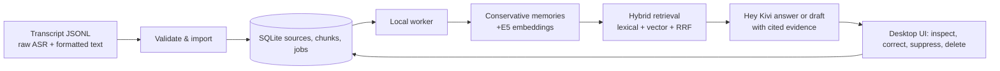

# Kivi Memory Workbench

Kivi Memory Workbench is a local, evidence-backed semantic-memory companion for transcript history. It preserves raw ASR and formatted text, indexes the history, derives cautious fact/preference candidates, and answers only with inspectable source evidence.

The product direction is summarized in [positioning_statement.md](positioning_statement.md) and [vision.md](vision.md).

The main interface is a desktop UI served by FastAPI at `127.0.0.1`. Its visual system uses a warm off-white workspace, forest-green type, pale-green evidence surfaces, and a direct path from a Hey Kivi answer to its source history.

## Product flow

1. Create a memory workspace and paste compatible UTF-8 JSONL.
2. Validate, import, and process records into durable SQLite jobs.
3. Ask Hey Kivi a question or request a draft.
4. Open every returned source in History to inspect its raw dictation, formatted transcript, indexed passages, and derived memory candidates.
5. Correct, suppress, or delete memory state. Revision checks and operation IDs make lifecycle operations safe to retry.

## Focused use cases

- **Recover context:** find a prior dictated update and open the original transcript rather than relying on a bare summary.
- **Understand changes:** retrieve the latest supported project detail while keeping earlier records visible for review.
- **Prepare a next response:** request a grounded draft whose supporting sources remain one click away.

## Architecture

- **UI:** React, TypeScript, Vite; desktop-first layout.
- **API/worker:** FastAPI, Pydantic and a local durable worker queue.
- **Persistence:** SQLite/WAL, SQLAlchemy, Alembic migrations.
- **Memory:** source records, chunks, embeddings, derived memories, and content-minimized lifecycle operations.
- **Retrieval:** lexical ranking plus normalized `intfloat/multilingual-e5-small` cosine ranking where local vectors are present; reciprocal-rank fusion selects cited source evidence. A deterministic character n-gram fallback is clearly used when E5 is unavailable.
- **Generation:** the server-only Sarvam adapter receives selected evidence. Without `SARVAM_API_KEY`, the product returns transparent source replay rather than inventing an LLM result.

## Included evidence

`data/synthetic-500.jsonl` is a deterministic, fictional 500-record corpus covering schedules, preferences, episodes, corrections, hypotheses, drafts, ASR differences, and code-switched Hindi examples. `eval/cases.jsonl` has 120 frozen evidence-labelled retrieval cases. The committed [evidence report](eval/results/evidence-report.json) records a completed local rehearsal: 120/120 expected source/text evidence checks passed.

With the server-side Sarvam key configured, [the live smoke report](eval/results/live-smoke-report.json) exercised one case from each of the 12 corpus families: 12/12 cases passed, with 7,624 total provider tokens and 1.12 s p50 / 3.22 s p95 end-to-end latency. At Sarvam's documented 2026-09-09 rates, those uncached input/output tokens cost an estimated ₹0.306152. It uses only fictional records and is a focused integration smoke test, not a broad model-quality claim.

The [multilingual embedding report](eval/results/multilingual-embedding-report.json) separately verifies the real persisted E5 path: an English dentist query ranks the fully Hindi dentist record first with no lexical rank, demonstrating that the result came through dense multilingual retrieval rather than token overlap.

That report verifies grounded source retrieval and provenance, not broad model quality. The evaluation does not claim comprehensive temporal reasoning, multi-hop reasoning, live Sarvam quality, or language-specific semantic-recall benchmarks.

## Run and inspect

See [RUN.md](RUN.md) for the exact fresh local setup, migration, seed, processing, evaluation, inspection, and reset commands. Input fields and limits are documented in [docs/import-format.md](docs/import-format.md).

Copy `backend/.env.example` to `backend/.env` only when you need local overrides. The real `.env`, databases, model cache, build output, and private working notes are ignored. GitHub Actions runs the offline backend tests and lint plus frontend type-check/build on every push and pull request.

## Deploy the frontend on Vercel

Live frontend: **[hey-kivi-sarvam-dnaq.vercel.app](https://hey-kivi-sarvam-dnaq.vercel.app/)**

The repository includes root-level Vercel configuration for the Vite frontend. A Vercel deployment works immediately in browser-local demo mode using `localStorage`: create a memory space, import JSONL, ask source-backed questions, inspect evidence, correct memories, suppress memories, and delete sources. For the full FastAPI/Sarvam workflow, set `VITE_API_BASE_URL` to the HTTPS origin of a separately running backend and add the final Vercel origin to that backend's `TRUSTED_ORIGINS`. Follow the complete [Vercel deployment guide](docs/deploy-vercel.md).

## Deploy the backend on Render

The repository includes a native Python Render blueprint (`render.yaml`) for deploying the FastAPI backend as a free web service:
- Run migrations and serve on Render using native Python 3.
- Set `TRUSTED_ORIGINS` to your Vercel URL (e.g. `https://hey-kivi-sarvam-dnaq.vercel.app`).
- Set `VITE_API_BASE_URL` in Vercel to your Render service URL to connect the two.
- Follow the complete [Render deployment guide](docs/deploy-render.md).

## Scope and limitations

The default backend setup is local and binds to loopback. A Vercel frontend cannot reach a backend bound only to `127.0.0.1`, so browser-local mode is provided for static review and public demos. A full shared deployment still needs a separate HTTPS backend with persistent storage. The project does not integrate with the installed Kivi application, transcribe live audio, or expose any provider credential to the browser. A Sarvam API key is optional and is never included in this repository. The Sarvam adapter was validated with a harmless synthetic end-to-end query; returned model and usage metadata are retained in the query trace. The committed 120-case report remains an offline provenance run, not a live-provider quality benchmark.

