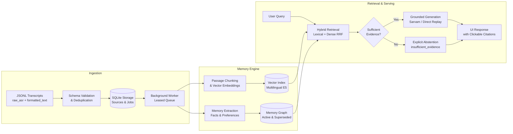

# Kivi Memory Workbench

An evidence-backed semantic memory engine for spoken interactions and transcript history. Kivi indexes dual-view transcripts (`raw_asr` and `formatted_text`), extracts durable facts and preferences, and generates answers strictly grounded in verifiable source evidence with full provenance.

[](https://fastapi.tiangolo.com/)
[](https://react.dev/)
[](https://www.typescriptlang.org/)
[](https://www.python.org/)
[](https://www.sqlite.org/)

> **Foundational Strategy:** Read the **[Product Positioning](positioning.md)** ($\le$ 100 words) and **[Product Vision](vision.md)** ($\le$ 600 words).

---

## Highlights

- **Dual-View Speech Ingestion**: Preserves raw speech recognition output (`raw_asr`) alongside formatted text (`formatted_text`), enabling phonetic matching without propagating speech disfluencies.
- **Hybrid Multilingual Retrieval**: Combines token-level lexical search with dense multilingual semantic vectors (`intfloat/multilingual-e5-small`) using Reciprocal Rank Fusion (RRF).
- **Strict Grounding & Abstention**: Queries return verbatim cited evidence spans. When context is missing or ambiguous, the engine explicitly abstains (`insufficient_evidence`) rather than hallucinating.
- **Auditable Memory Lifecycle**: Human-in-the-loop memory correction, suppression, and deletion backed by atomic revision checks and deduplication.
- **Flexible Execution**: Runs entirely locally via SQLite and embedded vector inference, or deploys as a distributed cloud service with optional LLM generation via Sarvam AI.

---

## System Architecture



---

## Live Deployments

- **Web Application (Vercel)**: [https://hey-kivi-sarvam-dnaq.vercel.app](https://hey-kivi-sarvam-dnaq.vercel.app)
- **API Service (Render)**: [https://hey-kivi-sarvam.onrender.com](https://hey-kivi-sarvam.onrender.com)
- **API Health**: [`/api/health`](https://hey-kivi-sarvam.onrender.com/api/health) | **Readiness**: [`/api/readiness`](https://hey-kivi-sarvam.onrender.com/api/readiness)

---

## Core Capabilities

### 1. Context Recovery & Search
Locate prior conversations, meetings, or dictated notes instantly. Results maintain clickable links back to original transcript records with timestamped offsets and raw audio transcripts.

### 2. Contradiction & Evolution Handling
When project plans or user preferences evolve, the engine tracks state transitions chronologically. Updated records supersede older claims while retaining complete historical audit logs.

### 3. Cross-Lingual Semantic Matching
Query in English to discover information dictated in Hindi or mixed code-switched speech. The dense vector engine maps multilingual meanings without requiring exact keyword matches.

### 4. Direct User Governance
Users can inspect, correct, or suppress any extracted memory directly through the web interface. Suppressed memories are instantly excluded from downstream synthesis, and source deletions cascade cleanly across all derived chunks and embeddings.

---

## Evaluation & Benchmarks

The repository includes a frozen evaluation suite covering factual recovery, cross-lingual search, temporal updates, and negative abstention:

| Benchmark Suite | Cases | Key Metric | Result | Notes |
| :--- | :---: | :--- | :---: | :--- |
| **Retrieval & Abstention Suite** | 120 | Grounded Accuracy | **120 / 120 (100%)** | Evaluates 110 positive cases across 12 domains + 10 negative abstention cases. |
| **Live Provider Smoke Suite** | 13 | End-to-End Success | **13 / 13 (100%)** | Live synthesis with `sarvam-105b`; p50 latency 1.12s, ₹0.30 total cost across 13 runs. |
| **Cross-Lingual Embedding Test** | 1 | Zero-Overlap Dense Match | **Passed** | English query (*"dentist appointment"*) retrieves pure Hindi record with 0 lexical overlap. |

Execution logs and reports are maintained under [`eval/results/`](eval/results/).

---

## Quick Start

### Prerequisites
- Python 3.12+ and [uv](https://docs.astral.sh/uv/)
- Node.js 20+ and npm

### Local Setup

```powershell
# 1. Install dependencies & build UI
uv sync --project backend --extra dev --extra embeddings --locked --link-mode copy
npm --prefix frontend ci && npm --prefix frontend run build

# 2. Initialize database, embeddings & seed data
uv run --project backend python -m kivi_memory.cli migrate
uv run --project backend python -m kivi_memory.cli doctor --download-embedding
uv run --project backend python -m kivi_memory.cli seed --namespace demo
uv run --project backend python -m kivi_memory.cli worker --drain

# 3. Start the application
uv run --project backend python -m kivi_memory.cli serve --host 127.0.0.1 --port 8000
```

Open [http://127.0.0.1:8000](http://127.0.0.1:8000) in your browser.

For complete operational instructions, evaluation commands, and blind dataset imports, see **[RUN.md](RUN.md)**.

---

## Project Structure

```text
├── backend/
│   ├── src/kivi_memory/    # FastAPI server, retrieval engine, memory lifecycle
│   ├── migrations/         # Alembic database schema migrations (0001-0004)
│   ├── tests/              # Pytest test suite (API, worker, retrieval, controls)
│   └── schemas/            # JSON Schema definitions for transcript validation
├── frontend/
│   ├── src/                # React + Vite application (TypeScript, CSS)
│   └── tests/              # Browser storage and state management unit tests
├── data/                   # Synthetic seed data generator & 500-record reference corpus
├── docs/                   # Architecture, data contracts, and deployment blueprints
└── eval/                   # Evaluation suites, natural question generators & test reports
```

---

## Documentation

- **[RUN.md](RUN.md)**: Operational guide, environment variables, evaluations, and reset procedures.
- **[docs/import-format.md](docs/import-format.md)**: Specifications for the JSONL transcript schema.
- **[docs/deploy-render.md](docs/deploy-render.md)**: Deploying the backend on Render.
- **[docs/deploy-vercel.md](docs/deploy-vercel.md)**: Deploying the frontend on Vercel.
- **[positioning.md](positioning.md)** (or [positioning_statement.md](positioning_statement.md)): Product positioning statement.
- **[vision.md](vision.md)**: Long-term product vision.


