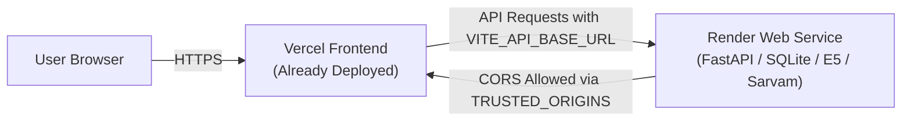

# Deploy Kivi Memory Backend on Render

This guide provides step-by-step instructions to deploy the **FastAPI backend** on **[Render](https://render.com)** as a native Python Web Service and connect it to your existing **Vercel frontend**.



---

## Prerequisites

1. Your code pushed to a **GitHub repository**.
2. A free account on **[render.com](https://render.com)**.
3. Your live **Vercel frontend URL** (e.g., `https://hey-kivi-sarvam-dnaq.vercel.app`).
4. (Optional) A `SARVAM_API_KEY` if you want AI-generated answers with Sarvam.

---

## Method 1: 1-Click Deploy with Blueprint (Recommended)

The repository includes a committed `render.yaml` blueprint that pre-configures all build settings automatically:

1. Log in to [Render Dashboard](https://dashboard.render.com).
2. Click **New +** in the top right and select **Blueprint**.
3. Connect your GitHub repository (`hey-kivi-sarvam`).
4. Render will read `render.yaml` and configure:
   - **Service Name**: `kivi-memory-backend`
   - **Runtime**: Python 3
   - **Plan**: Free
   - **Build Command**: `pip install uv && uv sync --project backend --locked`
   - **Start Command**: `uv run --project backend python -m kivi_memory.cli migrate && uv run --project backend python -m kivi_memory.cli serve --host 0.0.0.0 --port $PORT`
5. Under Environment Variables:
   - Replace the `TRUSTED_ORIGINS` value with your actual Vercel URL (e.g., `https://your-project.vercel.app,http://localhost:8000,http://127.0.0.1:8000`).
   - (Optional) Set `SARVAM_API_KEY` to your Sarvam API key.
6. Click **Apply**. Render will deploy your service.

---

## Method 2: Manual Setup via Render Dashboard

If you prefer to configure the service manually in the Render UI:

### Step 1: Create a New Web Service
1. In your [Render Dashboard](https://dashboard.render.com), click **New +** → **Web Service**.
2. Select **Build and deploy from a Git repository** and connect your repository.

### Step 2: Configure the Service Details
Fill in the following fields:

| Setting | Value |
| :--- | :--- |
| **Name** | `kivi-memory-backend` (or any name you prefer) |
| **Region** | Choose the closest region (e.g., *Oregon (US West)* or *Frankfurt (EU)*) |
| **Branch** | `main` (or your active branch) |
| **Root Directory** | *(leave empty)* |
| **Runtime** | **Python 3** |
| **Build Command** | `pip install uv && uv sync --project backend --locked` |
| **Start Command** | `uv run --project backend python -m kivi_memory.cli migrate && uv run --project backend python -m kivi_memory.cli serve --host 0.0.0.0 --port $PORT` |
| **Instance Type** | **Free** |

### Step 3: Add Environment Variables
Scroll down to **Environment Variables** and add:

| Key | Value | Description |
| :--- | :--- | :--- |
| `PYTHON_VERSION` | `3.12.13` | Ensures Render uses Python 3.12 |
| `TRUSTED_ORIGINS` | `https://your-project.vercel.app,http://localhost:8000` | Comma-separated allowed origins (replace with your Vercel URL) |
| `SARVAM_API_KEY` | *(Optional)* | Your Sarvam API key for AI generation (never exposed to browser) |

### Step 4: Configure Health Check Path
1. Click **Advanced**.
2. In **Health Check Path**, enter: `/api/health`
3. Click **Create Web Service**.

Render will now build your Python environment, install locked dependencies with `uv`, run the SQLite database migrations, and launch the FastAPI server.

---

## Connecting Vercel Frontend to Render Backend

Once Render finishes deploying:

### 1. Copy your Render Backend URL
Render will assign an HTTPS URL, for example:
`https://kivi-memory-backend.onrender.com`

Verify it is online by opening:
`https://kivi-memory-backend.onrender.com/api/health`
You should see:
```json
{"status":"alive","version":"0.1.0"}
```

### 2. Configure Vercel Environment Variable
1. Go to your project on [Vercel Dashboard](https://vercel.com).
2. Navigate to **Settings** → **Environment Variables**.
3. Add a new variable:
   - **Key**: `VITE_API_BASE_URL`
   - **Value**: `https://kivi-memory-backend.onrender.com` *(no trailing slash, no `/api`)*
   - **Target**: Check **Production**, **Preview**, and **Development**.
4. Click **Save**.

### 3. Redeploy Vercel
1. In Vercel, go to **Deployments**.
2. Click the three dots (`...`) on the latest deployment and select **Redeploy**.
3. Once the build finishes, open your Vercel app URL!

---

## Verifying the Live Integration

1. Open your Vercel app (`https://your-project.vercel.app`).
2. Look at the sidebar:
   - It should display **Backend connected** with a green dot (rather than *Browser workspace*).
3. Click **Create a memory space**.
4. Go to **Import** and paste a sample record:
   ```json
   {"schema_version":1,"id":"launch-01","raw_asr":"project lantern launches monday","formatted_text":"Project Lantern launches Monday."}
   ```
5. Click **Validate, import, and process**.
6. Switch to **Hey Kivi** and ask: `When does Project Lantern launch?`
7. The answer will be retrieved from your persistent Render backend with source citation!

---

## Troubleshooting & Tips

### Cold Starts on Render Free Tier
Render spins down free Web Services after 15 minutes of inactivity. The first request after a sleep may take 30–50 seconds while the instance spins up. Subsequent requests respond instantly.

### CORS Errors (`Blocked by CORS policy`)
If browser developer tools report a CORS error:
1. Ensure your Render environment variable `TRUSTED_ORIGINS` includes your exact Vercel domain (e.g., `https://hey-kivi-sarvam-dnaq.vercel.app`).
2. Alternatively, for testing you can set `TRUSTED_ORIGINS=*` on Render.
3. Restart the Render Web Service after modifying environment variables.

### Persistent Storage on Render
* On Render's **Free plan**, disk storage is ephemeral (cleared when the service restarts or redeploys).
* If you upgrade to Render's **Starter plan** ($7/mo), you can attach a **Render Persistent Disk**:
  - In Render Dashboard: **Disks** → **Add Disk**.
  - Mount Path: `/var/data`
  - Environment Variable: Add `APP_DATA_DIR=/var/data`
  - This ensures SQLite files persist across all redeployments and restarts.
