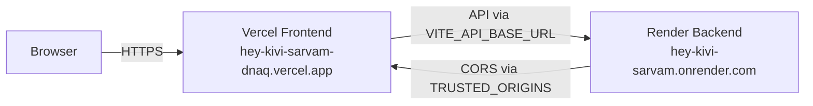

# Deploying the Kivi Backend on Render

Step-by-step guide to get the FastAPI backend running on [Render](https://render.com) and connected to the Vercel frontend.



## Current Live Deployment

| What | URL |
|:---|:---|
| Frontend | [hey-kivi-sarvam-dnaq.vercel.app](https://hey-kivi-sarvam-dnaq.vercel.app) |
| Backend | [hey-kivi-sarvam.onrender.com](https://hey-kivi-sarvam.onrender.com) |
| Health Check | [/api/health](https://hey-kivi-sarvam.onrender.com/api/health) |
| Readiness | [/api/readiness](https://hey-kivi-sarvam.onrender.com/api/readiness) |

---

## Prerequisites

1. Code pushed to a GitHub repository
2. Free [render.com](https://render.com) account
3. Your Vercel frontend URL
4. (Optional) `SARVAM_API_KEY` for AI synthesis + semantic entity extraction

---

## Method 1: Blueprint Deploy (Recommended)

The repo includes a `render.yaml` that configures everything automatically:

1. Go to [Render Dashboard](https://dashboard.render.com) → **New +** → **Blueprint**
2. Connect your GitHub repo (`memory_spoken-Interactions`)
3. Render reads `render.yaml` and sets up:
   - **Service**: `kivi-memory-backend` (Python 3, Free plan)
   - **Build**: `pip install uv && uv sync --project backend --locked`
   - **Start**: Runs `migrate` (all 5 migrations including the knowledge graph tables) → `serve`
4. Set environment variables:
   - `TRUSTED_ORIGINS` → your Vercel URL
   - `SARVAM_API_KEY` → your key (optional, enables LLM features)
5. Click **Apply**

The start command runs all Alembic migrations on boot, so the knowledge graph tables (`entities`, `entity_aliases`, `entity_mentions`, `entity_relations`) and memory decay columns are created automatically.

---

## Method 2: Manual Setup

### Create the Web Service

In Render Dashboard → **New +** → **Web Service** → connect your repo.

| Setting | Value |
|:---|:---|
| **Name** | `kivi-memory-backend` |
| **Runtime** | Python 3 |
| **Build Command** | `pip install uv && uv sync --project backend --locked` |
| **Start Command** | `uv run --project backend python -m kivi_memory.cli migrate && uv run --project backend python -m kivi_memory.cli serve --host 0.0.0.0 --port $PORT` |
| **Instance Type** | Free |

### Environment Variables

| Key | Value | Notes |
|:---|:---|:---|
| `PYTHON_VERSION` | `3.12.13` | Ensures Python 3.12 |
| `TRUSTED_ORIGINS` | `https://your-app.vercel.app,http://localhost:8000` | Comma-separated CORS origins |
| `SARVAM_API_KEY` | *(your key)* | Optional: enables Sarvam 105B synthesis + entity extraction |

### Health Check

Under **Advanced**, set Health Check Path to `/api/health`.

---

## Connecting Vercel to Render

Once Render is deployed:

1. Copy your Render URL (e.g., `https://hey-kivi-sarvam.onrender.com`)
2. Verify it's up: open `/api/health` → should return `{"status":"alive","version":"0.1.0"}`
3. In [Vercel Dashboard](https://vercel.com) → **Settings** → **Environment Variables**:
   - Key: `VITE_API_BASE_URL`
   - Value: `https://hey-kivi-sarvam.onrender.com` (no trailing slash)
4. Redeploy Vercel

---

## Verifying the Integration

1. Open your Vercel app
2. Sidebar should show **Backend connected** with a green dot
3. Create a memory space → Import a sample record:
   ```json
   {"schema_version":1,"id":"test-01","raw_asr":"project lantern launches monday","formatted_text":"Project Lantern launches Monday."}
   ```
4. Ask in **Hey Kivi**: "When does Project Lantern launch?"
5. Should get a grounded answer with a source citation

---

## Good to Know

### Cold Starts
Render's free tier sleeps after 15 min of inactivity. First request takes ~30–50s to wake up. After that, responses are fast.

### CORS Errors
If you see `Blocked by CORS policy`, make sure `TRUSTED_ORIGINS` includes your exact Vercel domain. Restart the Render service after changing env vars.

### Persistent Storage
Free tier disk is ephemeral (cleared on redeploy). For persistent SQLite across deploys, upgrade to Render Starter ($7/mo) and attach a Persistent Disk:
- Mount: `/var/data`
- Env var: `APP_DATA_DIR=/var/data`

### What Runs on Boot
The start command does two things in sequence:
1. `migrate`: Runs all Alembic migrations (0001–0005), creating all 11 tables
2. `serve`: Starts the FastAPI server on `0.0.0.0:$PORT`
